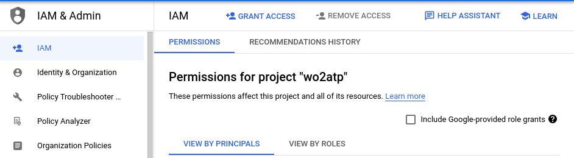
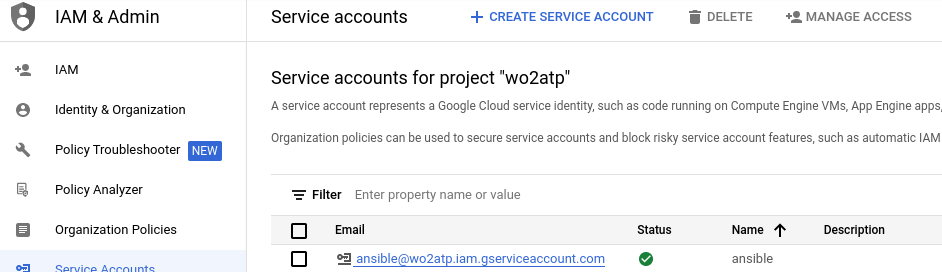

# installation oracle par ansible

Ansible      | Oracle DB 21c| Spring-boot| MAVEN      | GCP
:-----------:|:-----------:|:-----------:|:-----------:|:-----------:
 |  |  |  | 

## spécifiques 

- OS Remote : centos Linux stream 8 x 2 sur GCP
- OS Local: Arch Linux 22.0.0
- ansible version: 2.13.4
- python version: 3.10.7 


## les Tasks à faire

dans ce projet on va crée deux instances GCP 

- [x] TASK 1: préparer le système (DB server)
  - [x] installation des dépendances
  - [x] configurer les paramètre du système
  - [x] exporter les variable d’environnement
  - [x] copier le fichier d'installation de la template
  - [x] configurer le parfeu
  - [x] configurer Selinux
  - [x] configurer les limits pour l'utilisateur oracle
  - [x] redémarrage et attente pour une connexion ssh
- [x] TASK 2: installation de la base oracle 21c (DB server)
  - [x] démarre le fichier d'installation
  - [x] crée la base DATA
- [x] TASK 3: préparer le système (VM 2)
  - [x] installation des dépendances
  - [x] configurer le parfeu
  - [x] configurer Selinux
  - [x] configurer les limits pour l'utilisateur adm
  - [x] redémarrage et attente pour une connexion ssh
  - [x] install Nginx (web server )
- [ ] TASK 5: installation automatique de WebLogic (VM 2)
  - [ ] deployer et installer weblogic par ansible
- [x] TASK 6: REST API (VM 2)
  - [x] connecter la base Oracle avec l'app
  - [x] crée une REST api
  - [ ] deployer dans un serveur web

# google cloud platform (GCP)

### creation d'un service account dans IAM & admin

*IAM & admin* nous permet de contrôler les privilèges et les permissions de chaque rôle 



![service account]{./pics/serviceaccount.png}
 
 après on donne le role: *Compute Admin*


### le

 pour savoir les images qu'on peut utulise:

 ```console
 🏴‍☠️[~] gcloud compute images list | grep rhel                                                                                                                                                             17:33:33 
 rhel-7-v20220920                                      rhel-cloud           rhel-7                                         READY
 rhel-8-v20220920                                      rhel-cloud           rhel-8                                         READY
 rhel-9-arm64-v20220920                                rhel-cloud           rhel-9-arm64                                   READY
 rhel-9-v20220920                                      rhel-cloud           rhel-9                                         READY
 rhel-7-6-sap-v20220920                                rhel-sap-cloud       rhel-7-6-sap-ha                                READY
 rhel-7-7-sap-v20220920                                rhel-sap-cloud       rhel-7-7-sap-ha                                READY
 rhel-7-9-sap-v20220920                                rhel-sap-cloud       rhel-7-9-sap-ha                                READY
 rhel-8-1-sap-v20220920                                rhel-sap-cloud       rhel-8-1-sap-ha                                READY
 rhel-8-2-sap-v20220920                                rhel-sap-cloud       rhel-8-2-sap-ha                                READY
 rhel-8-4-sap-v20220920                                rhel-sap-cloud       rhel-8-4-sap-ha                                READY
 rhel-8-6-sap-v20220920                                rhel-sap-cloud       rhel-8-6-sap-ha                                READY
 🏴‍☠️[~] 
 ```

- le recherche avant est fait sur les images publiques disponibles de rhel(Red Har Entreprise Linux)
- on peut cree notre images modifié  aui va nous répondre à nôtre besoin spécifique par ( [Packer](https://www.packer.io/) + [Vagrant](https://www.vagrantup.com/))( à faire)

### travailler avec python
- installation python > 3.6
- install pip
- creation d'un envirenement virtuelle 
```bash
                            python3 -m venv venv
```
- acctiver de l'envirenement
```python
source .venv/bin/acctivate
```
- installation des packages nessecaires: 
```bash
pip install -r requirement.txt
```

### création de deux instances manuellement

```console
🏴‍☠️[~] gcloud compute instances create weblo --project=utopian-eye-362016 --zone=europe-west3-c --machine-type=e2-medium --network-interface=address=34.107.41.147,network-tier=PREMIUM,subnet=default --maintenance
-policy=MIGRATE --provisioning-model=STANDARD --service-account=126104345237-compute@developer.gserviceaccount.com --scopes=https://www.googleapis.com/auth/devstorage.read_only,https://www.googleapis.com/auth/logging.write,https://www.googleapis.com/auth/monitoring.write,https://www.googleapis.com/auth/servicecontrol,https://www.googleapis.com/auth/service.management.readonly,https://www.googleapis.com/auth/trace.append --tags=http-server,https-server --create-disk=auto-delete=yes,boot=yes,device-name=weblo,image=projects/debian-cloud/global/images/debian-11-bullseye-v20220920,mode=rw,size=10,type=projects/utopian-eye-362016/zones/us-west4-b/diskTypes/pd-balanced --no-shielded-secure-boot --shielded-vtpm --shielded-integrity-monitoring --reservation-affinity=any
Created [https://www.googleapis.com/compute/v1/projects/utopian-eye-362016/zones/europe-west3-c/instances/weblo].
NAME   ZONE            MACHINE_TYPE  PREEMPTIBLE  INTERNAL_IP  EXTERNAL_IP    STATUS
weblo  europe-west3-c  e2-medium                  10.156.0.5   34.107.41.147  RUNNING
🏴‍☠️[~] gcloud compute instances create oradb --project=utopian-eye-362016 --zone=europe-west3-c --machine-type=e2-medium --network-interface=address=34.159.55.61,network-tier=PREMIUM,subnet=default --maintenance-
policy=MIGRATE --provisioning-model=STANDARD --service-account=126104345237-compute@developer.gserviceaccount.com --scopes=https://www.googleapis.com/auth/devstorage.read_only,https://www.googleapis.com/auth/logging.write,https://www.googleapis.com/auth/monitoring.write,https://www.googleapis.com/auth/servicecontrol,https://www.googleapis.com/auth/service.management.readonly,https://www.googleapis.com/auth/trace.append --create-disk=auto-delete=yes,boot=yes,device-name=oradb,image=projects/debian-cloud/global/images/debian-11-bullseye-v20220920,mode=rw,size=10,type=projects/utopian-eye-362016/zones/us-west4-b/diskTypes/pd-balanced --no-shielded-secure-boot --shielded-vtpm --shielded-integrity-monitoring --reservation-affinity=any
Created [https://www.googleapis.com/compute/v1/projects/utopian-eye-362016/zones/europe-west3-c/instances/oradb].
NAME   ZONE            MACHINE_TYPE  PREEMPTIBLE  INTERNAL_IP  EXTERNAL_IP   STATUS
oradb  europe-west3-c  e2-medium                  10.156.0.6   34.159.55.61  RUNNING
🏴‍☠️[~] gcloud compute instances list                                                                                                                                                                       1:17:32 
NAME   ZONE            MACHINE_TYPE  PREEMPTIBLE  INTERNAL_IP  EXTERNAL_IP    STATUS
oradb  europe-west3-c  e2-medium                  10.156.0.6   34.159.55.61   RUNNING
weblo  europe-west3-c  e2-medium                  10.156.0.5   34.107.41.147  RUNNING
🏴‍☠️[~] 
```

### création de deux instances par ansible

### démarrer l'API

```console
mvn spring-boot:run 
```

### api

### creation d'un serveur DNS (Bonus)

puisque on a cree des ip statiques pour les deux instances on ajoute un serveur dns qui nous permet la communication entre les deux instances avec un nom du domaine au lieu de l'adresse ip et ce qui nous donne un
